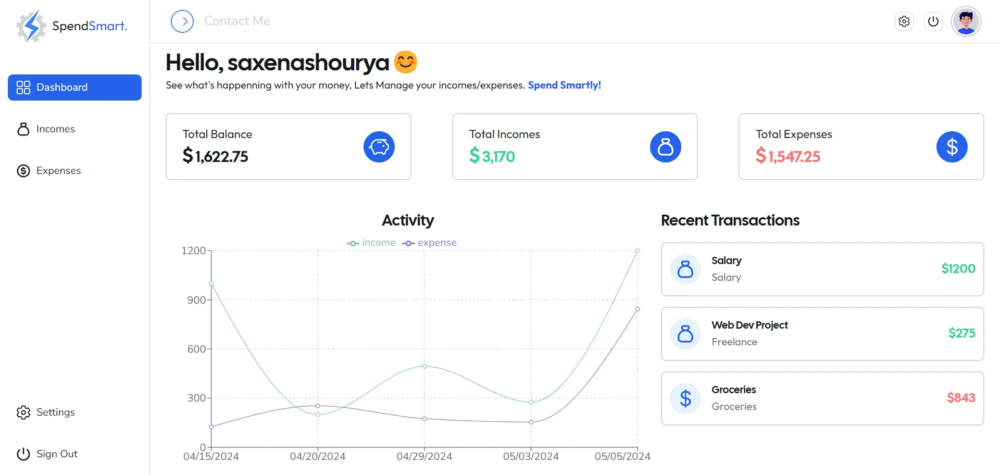

  
 <h1 align="center">Penny Wise — Smart Finance, Smarter You</h1> 
 <em>A full-stack personal finance tracker to help you budget better and live wiser.</em> 
 
  
 <h2 align="center"> <a href="https://your-penny-wise-app-link.com">🚀 Check Out the Live Demo</a> </h2>
💡 About Penny Wise
Penny Wise is your minimalist yet powerful finance companion. Log every expense, track income, visualize your budget, and understand where your money flows — all from a clean, intuitive dashboard.

Whether you're saving for a dream vacation or just trying to stop ordering too much takeout, Penny Wise has your back.

🧰 Features
Here's what you can do with Penny Wise:

🧾 Expense Logging — Categorize, tag, and track daily expenses.

💰 Income Management — Stay on top of every source of incoming cash.

🔐 Secure Authentication — JWT-based login system to keep your data private.

📊 Analytics Dashboard — Get visual insights into your spending habits.

🎯 Custom Budgets — Set spending limits and stay within goals.

☁️ Deployed & Ready — Easily deployable on Vercel & MongoDB Atlas.

⚙️ Getting Started
Prerequisites
Make sure you have the following installed:

Node.js

MongoDB (local or Atlas)

Git

🛠️ Installation
Clone the repo:

bash
Copy
Edit
git clone https://github.com/k-vineesh/penny-wise.git
cd penny-wise
Set up environment variables:

Inside the backend/ directory, create a .env file based on the env.example provided.

bash
Copy
Edit
cd backend
Example .env:

env
Copy
Edit
PORT=3000
MONGO_URI=mongodb://localhost:27017/penny_wise
JWT_SECRET_KEY=super_secret_key
NODE_ENV=development
EMAIL_USER=your_email@example.com
EMAIL_PASS=your_app_password
Install dependencies and run the app:

bash
Copy
Edit
npm run setup      # Installs frontend & backend dependencies
npm run dev        # Starts both frontend & backend
🧪 What I Learned
Working on Penny Wise sharpened my full-stack skills and gave me a deeper appreciation for clean, maintainable architecture. Here are some key takeaways:

🔄 React & Redux Toolkit — Built responsive UI with modern state management.

🌐 Node.js + Express — Developed a secure, scalable REST API.

🍃 MongoDB + Mongoose — Managed data with flexible, schema-based modeling.

🛡 JWT Auth — Implemented secure token-based user sessions.

🎨 UI/UX Design — Prioritized usability with a minimal, mobile-friendly interface.

☁️ Deployment — Hosted frontend on Vercel and backend on Render/Docker.

🚦 Agile Flow — Worked in sprints, practiced version control and CI/CD workflows.

📄 License
This project is licensed under the MIT License.

📬 Feedback & Contact
Got feedback or ideas? Drop me a mail at: your.email@example.com

Let's connect on LinkedIn